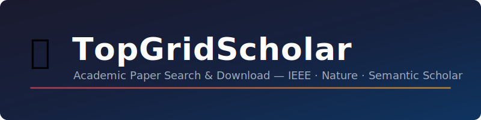

<p align="center">
  
</p>

<p align="center">
  <a href="LICENSE"></a>
  
  
  
</p>

<p align="center">
  <a href="README.md">English</a> | <a href="README_zh.md">中文</a>
</p>

---

A Streamlit-based tool for searching and batch-downloading academic papers from **IEEE Xplore**, **Nature**, and **Semantic Scholar** (CCF-A/B venues). It uses browser automation to leverage your institutional access and downloads PDFs with full metadata.

## Features

- **Multi-source search** — IEEE Xplore, Nature, and Semantic Scholar (CCF-A/B journals & conferences)
- **Batch PDF download** — queue papers and download them automatically with retry support
- **Institutional access** — uses a persistent browser profile so your campus login session is preserved
- **Anti-scraping measures** — random delays, human-like scrolling, and mouse movement
- **Metadata export** — export search results to CSV (title, authors, affiliations, DOI, abstract, etc.)
- **Session persistence** — download queue survives restarts; interrupted downloads resume automatically

## Quick Start

```bash
pip install git+https://github.com/LuChuanfan/TopGridScholar.git
playwright install chromium
topgridscholar
```

## Prerequisites

- **Python 3.10+**
- **Institutional network access** (campus VPN or on-campus network) for IEEE/Nature full-text downloads
- (Optional) A [Semantic Scholar API key](https://www.semanticscholar.org/product/api) for CCF-A/B search

## Installation

1. Install the package:
   ```bash
   pip install git+https://github.com/LuChuanfan/TopGridScholar.git
   ```

2. Install the Chromium browser for Playwright:
   ```bash
   playwright install chromium
   ```

3. (First time) Set up browser login:
   ```bash
   topgridscholar setup
   ```
   A Chromium window will open. Log in to IEEE Xplore / Nature through your institution, then close the browser. Your session cookies are saved locally.

## Configuration

Copy the example environment file and edit it:

```bash
cp .env.example .env
```

| Variable | Description | Required |
|---|---|---|
| `SEMANTIC_SCHOLAR_API_KEY` | API key for Semantic Scholar CCF-A/B search | Optional |
| `PAPERDOWNLOADER_BASE_DIR` | Override the default data directory (defaults to current working directory) | Optional |

## Usage

```bash
topgridscholar
```

The web UI has three pages:

1. **Search** — enter keywords, choose a source (IEEE / Nature / Semantic Scholar), and run the search
2. **Results** — browse, filter, and select papers; export metadata to CSV
3. **Download** — manage the download queue, monitor progress, retry failed items

## Supported Sources

| Source | Search | PDF Download | Requires Login |
|---|---|---|---|
| IEEE Xplore | Keyword / per-journal | Via stampPDF | Yes (institutional) |
| Nature | Keyword | Direct PDF link | Yes (institutional) |
| Semantic Scholar | Keyword + CCF venue filter | Open Access only | No (API key optional) |

## Important Notes

- **Institutional access required** — IEEE and Nature PDF downloads rely on your campus network or VPN. Without it, you can still search and view metadata, but PDFs may not be available.
- **Respect rate limits** — the tool includes built-in delays between requests. Do not remove or reduce them, as this may trigger anti-scraping protections and get your IP blocked.
- **Browser profile** — login cookies are stored in `data/chrome_profile/`. Do not share this directory.
- **Data directory** — all runtime data (sessions, downloads, state) is stored in `data/` and excluded from git.

## FAQ

**Q: The browser doesn't open / Playwright fails on Windows.**
A: Make sure you ran `playwright install chromium`. On Windows, the tool automatically uses `ProactorEventLoop` for compatibility.

**Q: PDFs download as empty or very small files.**
A: This usually means you don't have access to the full text. Check that you're on your campus network or connected to your institution's VPN.

**Q: Semantic Scholar search returns no results.**
A: Try without venue filters first. If you get a 401/403 error, set `SEMANTIC_SCHOLAR_API_KEY` in your `.env` file.

**Q: Can I change where files are saved?**
A: Set `PAPERDOWNLOADER_BASE_DIR` in `.env` to any path you like. The tool will create `data/` subdirectories there.

## License

This project is licensed under the [MIT License](LICENSE).
